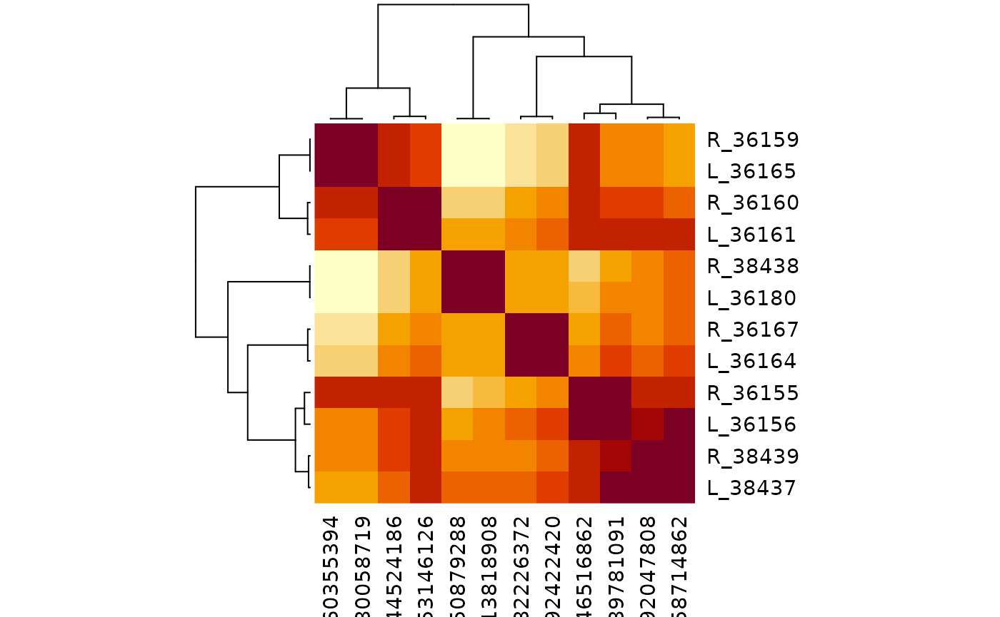
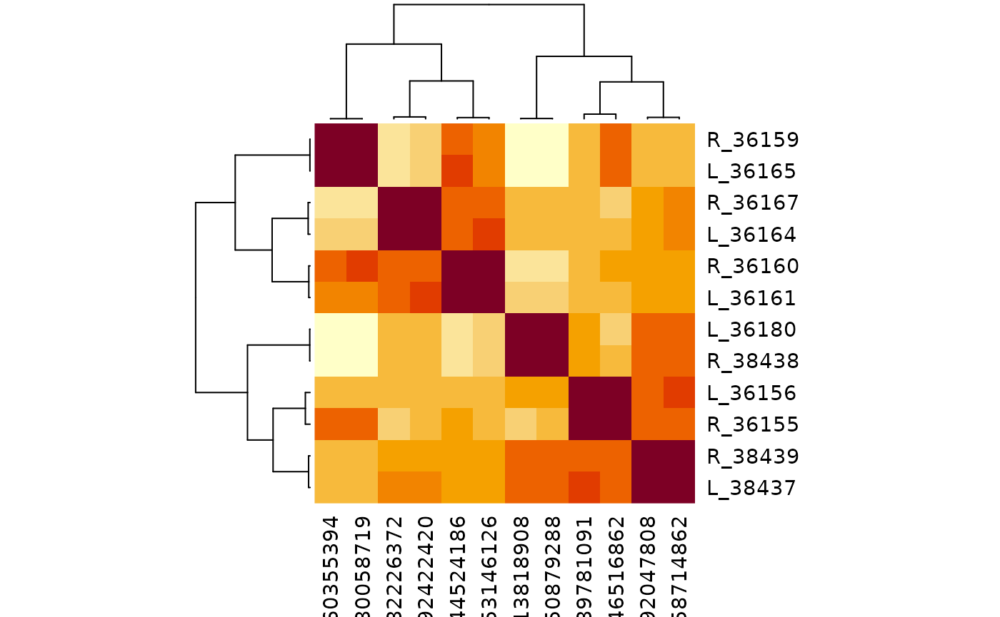

# Connectivity Clustering with Predicted Groups

This vignette clusters a set of related Aedes neurons by their
connectivity using [coconatfly](https://natverse.org/coconatfly)’s
[`cf_cosine_plot()`](https://natverse.org/coconatfly/reference/cf_cosine_plot.html).
Cosine clustering compares neurons by the partners they share, and those
partners must first be grouped, so that e.g. two neurons that each
contact a different member of the same partner cell type still count as
similar.

In well annotated datasets partners are grouped by cell `type`. Most
aedes neurons do not yet have a type, so we compare two alternatives:

- `group`: the curated group (see
  [`aedes_set_group()`](../reference/aedes_set_group.md)).
- `pgroup`: the predicted group from
  [`aedes_predict_group()`](../reference/aedes_predict_group.md), which
  uses the first available of cell type, curated `group` and NBLAST
  cluster.

The chunks below need FlyTable and CAVE access. They are evaluated when
the pkgdown website is built; elsewhere saved results are shown instead
(see [Rerunning this vignette](#rerunning-this-vignette)).

``` r

library(aedes)
library(coconatfly)
library(dplyr)
register_aedes_coconat()
```

## Quick start

Once
[`register_aedes_coconat()`](../reference/register_aedes_coconat.md) has
been called, coconatfly metadata for aedes neurons includes a `pgroup`
column, so you can simply choose the grouping column:

``` r

cf_cosine_plot(cf_ids(aedes = "group:36155"), group = "group")
cf_cosine_plot(cf_ids(aedes = "group:36155"), group = "pgroup")
```

## Fetch the connectivity once

As an example we use the 12 untyped visual projection neurons in group
36155. Rather than letting
[`cf_cosine_plot()`](https://natverse.org/coconatfly/reference/cf_cosine_plot.html)
fetch connectivity each time, we fetch a connection table once with
`group = FALSE` and then cluster it with different grouping columns.

``` r

ids <- cf_ids(aedes = "group:36155")
cf_meta(ids) %>% select(id, serial_id, side, group, nblast_group)
#>                    id serial_id side group nblast_group
#> 1  648518347546516862     36155    R 36155        36155
#> 2  648518347589781091     36156    L 36155        36155
#> 3  648518347560355394     36159    R 36155        36155
#> 4  648518347544524186     36160    R 36155        36155
#> 5  648518347553146126     36161    L 36155        36155
#> 6  648518347592422420     36164    L 36155        36155
#> 7  648518347480058719     36165    L 36155        36155
#> 8  648518347482226372     36167    R 36155        36155
#> 9  648518347513818908     36180    L 36155        36155
#> 10 648518347558714862     38437    L 36155        36155
#> 11 648518347650879288     38438    R 36155        36155
#> 12 648518347592047808     38439    R 36155        36155

x <- multi_connection_table(ids, partners = c("in", "out"), threshold = 5,
                            group = FALSE)
```

Partner neurons without a label in the chosen column cannot act as
shared features and are dropped. We can check what fraction of the
partner synapses each column covers:

``` r

cov <- x %>%
  group_by(partners) %>%
  summarise(type = sum(weight[!is.na(type)]) / sum(weight),
            group = sum(weight[!is.na(group)]) / sum(weight),
            pgroup = sum(weight[!is.na(pgroup)]) / sum(weight)) %>%
  mutate(across(-partners, ~ round(.x, 3))) %>%
  as.data.frame()
cov
#>   partners  type group pgroup
#> 1   inputs 0.001 0.126  0.161
#> 2  outputs 0.008 0.324  0.632
```

Cell types cover under 1% of partner synapses, so `group = "type"` is
not useful here. Using `pgroup` rather than `group` raises coverage of
output synapses from 32% to 63%. Input coverage stays low because most
of the input partners are not yet in FlyTable at all.

## Cluster by curated group

``` r

cf_cosine_plot(x, group = "group", labRow = "{side}_{serial_id}")
#> Warning in coconat::partner_summary2adjacency_matrix(x[["outputs"]], inputcol =
#> "pre_key", : Dropping: 1451/1715 neurons representing 20029/29629 synapses due
#> to missing ids!
#> Warning in coconat::partner_summary2adjacency_matrix(x[["inputs"]], inputcol =
#> groupcol, : Dropping: 4335/4477 neurons representing 51965/59464 synapses due
#> to missing ids!
```



## Cluster by predicted group

``` r

cf_cosine_plot(x, group = "pgroup", labRow = "{side}_{serial_id}")
#> Warning in coconat::partner_summary2adjacency_matrix(x[["outputs"]], inputcol =
#> "pre_key", : Dropping: 1068/1715 neurons representing 10916/29629 synapses due
#> to missing ids!
#> Warning in coconat::partner_summary2adjacency_matrix(x[["inputs"]], inputcol =
#> groupcol, : Dropping: 4261/4477 neurons representing 49905/59464 synapses due
#> to missing ids!
```



At the time of writing (September 2026) both groupings split the 12
neurons into six left/right pairs, which is reassuring. With `pgroup`
the extra partner information gave a crisper result: 36155/36156 and
38437/38439 separated cleanly into two pairs rather than forming one
loosely resolved cluster of four.

## How the predicted group is defined

[`aedes_predict_group()`](../reference/aedes_predict_group.md) returns
ids that all live in the `serial_id` namespace, taking the first of
these that is available:

1.  **type**: the smallest `serial_id` among neurons of that type (a
    trailing `?` is ignored, as are uninformative types listed in
    `badtypes`).
2.  **group**: the curated `group`.
3.  **nblast_group**: clusters of the form `CNNNNN` or `NNNNN`, where
    `NNNNN` is the smallest `serial_id` in the cluster (surrounding
    whitespace and a trailing `?` are ignored). Any other value is
    ignored, so a bad cluster can be struck out by prefixing it with `X`
    (e.g. `XC12345`) without deleting the information.

Neurons with none of these get `NA` and are dropped as partners. With
`singletons = TRUE` they instead fall back to their own `serial_id`,
i.e. a group of one, so that every partner in FlyTable keeps its
connectivity as a feature, behaving like `group = FALSE` for that
neuron. This is off by default because a singleton partner can only be
shared by neurons on the same side of the brain, which tends to pull
left/right homologues apart.

Because type-derived ids use the smallest `serial_id` among the rows
supplied, they can depend on which neurons are in the table. Within one
[`cf_cosine_plot()`](https://natverse.org/coconatfly/reference/cf_cosine_plot.html)
call the partner metadata for each direction is fetched together, so the
ids are consistent where it matters.

You can also compute predicted groups yourself, e.g. to use a custom
`badtypes` list:

``` r

x$pgroup2 <- aedes_predict_group(x, badtypes = c(NA, "", "undefined"))
cf_cosine_plot(x, group = "pgroup2", labRow = "{side}_{serial_id}")
#> Warning in coconat::partner_summary2adjacency_matrix(x[["outputs"]], inputcol =
#> "pre_key", : Dropping: 1068/1715 neurons representing 10916/29629 synapses due
#> to missing ids!
#> Warning in coconat::partner_summary2adjacency_matrix(x[["inputs"]], inputcol =
#> groupcol, : Dropping: 4261/4477 neurons representing 49905/59464 synapses due
#> to missing ids!
```


## Rerunning this vignette

The results above depend on the live FlyTable annotations and CAVE
connectivity, so they will change as proofreading and annotation
progress.

- **Website.** The pkgdown GitHub Actions workflow has the necessary
  FlyTable and CAVE credentials and evaluates this vignette in full
  whenever the site is rebuilt and deploys it on every push to `main`
  (pull requests also build the site, but do not deploy it). To refresh
  it without a push, trigger the workflow manually from the repository’s
  Actions tab or with `gh workflow run pkgdown.yaml`.

- **Locally.** With FlyTable and CAVE access set up, render the vignette
  with the live chunks enabled:

  ``` r

  Sys.setenv(AEDES_LIVE_VIGNETTES = "true")
  rmarkdown::render("vignettes/connectivity-clustering.Rmd")
  ```

- **Saved results.** When not evaluated live (e.g. during `R CMD check`
  or
  [`vignette("connectivity-clustering")`](../articles/connectivity-clustering.md)
  from an installed package) the saved figures in `vignettes/figures/`
  are shown. To refresh them, also set
  `AEDES_SAVE_VIGNETTE_FIGURES=true` when rendering locally, then update
  the saved coverage table and the “at the time of writing” text to
  match.
