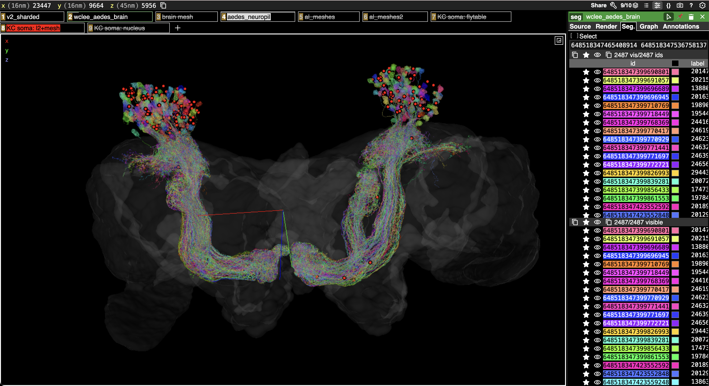

```{r, include = FALSE}
knitr::opts_chunk$set(
  collapse = TRUE,
  comment = "#>"
)
```

This vignette identifies soma/root positions for Kenyon cells (KCs) and then 
adds point annotations to an existing Neuroglancer/Spelunker scene.

The `aedes_soma_position()` call can use FlyTable soma coordinates,
nucleus table, and finally an L2 peoperties + signed neuropil mesh distance
fallback for neurons without either of those.
For large cell classes, pass a parallel backend via `cl` and leave the default
`chunksize = 20L` so L2 attributes are fetched in batches.

```{r setup, message=FALSE}
library(aedes)
library(dplyr)
library(fafbseg)
```

## Find KC Soma Positions

```{r kc-soma-positions, eval=FALSE}
kcs <- aedes_meta("class:KC")
kcsp <- aedes_soma_position(kcs$root_id, cl = 4)
kcsp %>% count(source)
```

## Add Soma Annotations to a Scene

The positions returned by `aedes_soma_position()` are in nm coordinates by
default, so `ngl_annotation_layers()` should use `rawcoords = FALSE`.

Use `with_aedes()` when making annotation layers so that `fafbseg` uses the 
Aedes Neuroglancer context, to obtain the correct voxel dimensions.

```{r add-to-scene, eval=FALSE}
singletonurl <- "https://spelunker.cave-explorer.org/#!middleauth+https://global.daf-apis.com/nglstate/api/v1/4738104991678464"
rawcoords <- FALSE

kc_ann <- kcsp %>%
  filter(!is.na(position)) %>%
  transmute(
    point = position,
    segments = as.character(root_id),
    layer = paste0("KC soma: ", source)
  )
kc_cols <- setNames(rainbow(n_distinct(kc_ann$layer)), unique(kc_ann$layer))

with_aedes({
  kc_scene <- ngl_decode_scene(singletonurl) +
    ngl_annotation_layers(kc_ann, rawcoords = rawcoords, colpal = kc_cols)
})
kcurl=ngl_encode_url(kc_scene)
browseURL(kcurl)
```

The resulting scene will have separate annotation layers for each soma source,
with source-specific colours:



If you ask for raw voxel coordinates instead, create `kcsp` with
`units = "raw"` and set `rawcoords <- TRUE` before calling
`ngl_annotation_layers()`.
