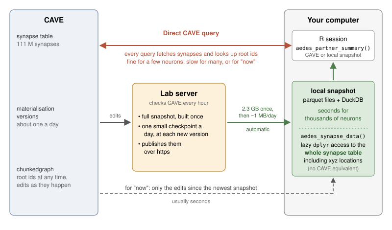
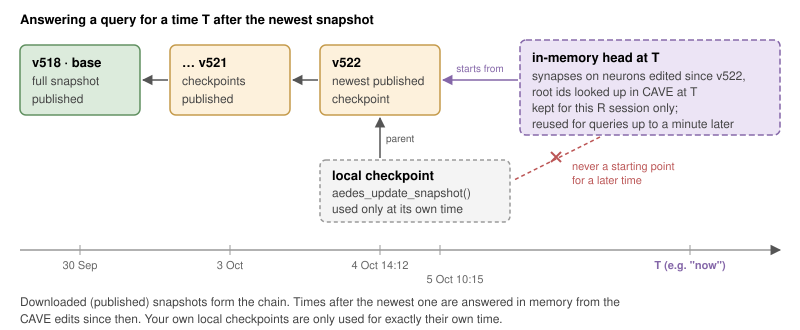
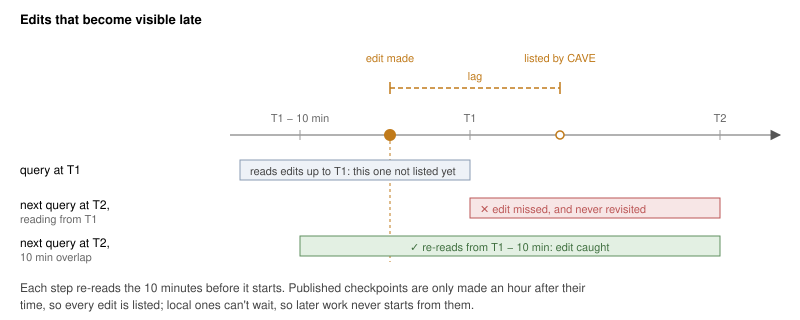
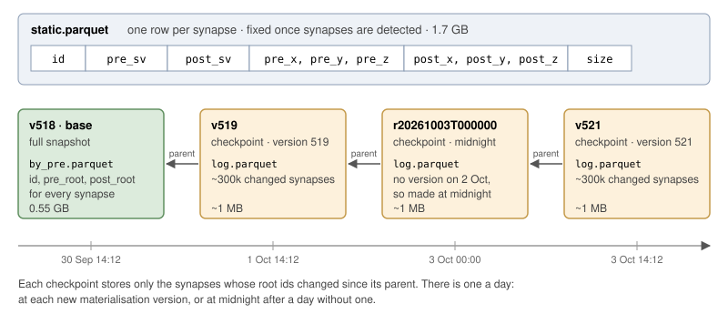
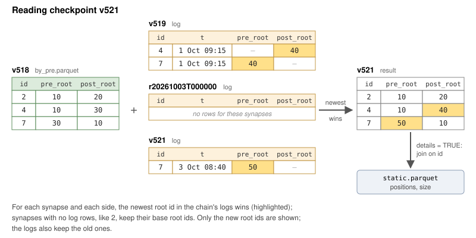

```{r, include = FALSE}
knitr::opts_chunk$set(
  collapse = TRUE,
  comment = "#>",
  eval = FALSE
)
```

This vignette explains how to use a local copy of the Aedes synapse table in order to enable connectivity queries that can reflect edits up to the latest second but are still very fast (think one second to find the partners of hundreds of neurons vs 5 minutes via CAVE). The catch is a one time download of about 2 GB of data onto the user's machine. You also have access to the full synapse table including the location of every synapse.

## Quick Start

If you have access to the aedes CAVE datastack:

```{r tldr}
library(aedes)
aedes_use_snapshot()
aedes_set_version('now')
dn.now <- aedes_partner_summary("superclass:descending_neuron", partners = "inputs")
aedes_set_version('latest')
dn.lat <- aedes_partner_summary("superclass:descending_neuron", partners = "inputs")
```

The first time, `aedes_use_snapshot()` offers to download a snapshot (consisting of about 1.5 GB of static synapse data that never changes and 0.5 GB of materialisation informatino that matches synapses to current root_ids). After that, new checkpoints (a few MB) are downloaded
automatically every day when you use the snapshot and deltas up to the current time can be computed on your machine. Collectively this allows time travel to arbitrary timepoints in the evolving connectome connectivity graph. In particular this
allows user to access both the most recent CAVE materialisation version (e.g. 519) and the current time ("now") for up to the second queries - very useful during
simultaneous proofreading and typing.

## Key Points

* Snapshots are made on a lab server and downloaded automatically: one full
  base, plus a small checkpoint each day and at each materialisation version.
* For `"now"`, or any time after the newest snapshot, aedes fetches the edits
  made since that snapshot from CAVE. The result is kept in memory for the
  rest of the R session, so only the first query is slow. Nothing is written
  to disk.
* Root ids only make sense at one time, so fix the time once
  (`now <- Sys.time()`) and use it for every call.
* Each materialisation version has its own snapshot (e.g. `v519`), so
  repeating an analysis at a version needs no CAVE lookups.

Read on for more details, and see [More Details](#more-details) for how
times after the newest snapshot work.

## Introduction

```{r fig-overview, echo = FALSE, eval = TRUE, out.width = "100%"}

```

The Aedes synapse table has about 111 million synapses. Querying it through
CAVE is fine for a few neurons, but it is slow for tens to thousands of
neurons, especially at the latest state of the dataset. A local synapse
snapshot is a copy of the whole table as parquet files, which aedes queries
with [DuckDB](https://duckdb.org). This gives you:

* **fast queries for the latest state of the dataset ("now")**. Only the
  edits made since the snapshot are fetched from CAVE, so you can work with
  up to date connectivity for large numbers of neurons. This is impractical
  with live CAVE queries.
* **fast partner summaries**. Thousands of neurons take seconds.
* **the full synapse table**, including the positions of the pre and
  postsynaptic points and the synapse size, for your own dplyr queries with
  `aedes_synapse_data()`. This is only possible with a snapshot; there is no
  equivalent CAVE query.
* **a fast local cache of a materialisation version**. CAVE (via the
  chunkedgraph) already lets you go back to any time; a snapshot makes
  repeating an analysis at one particular version fast.

## Vocabulary

| Term | Meaning |
|---|---|
| synapse table | the CAVE table with every synapse in the dataset |
| static data | the columns of the synapse table that never change: synapse id, pre and postsynaptic supervoxels, positions and size (`static.parquet`, 1.7 GB) |
| snapshot | the root ids of both partners of every synapse at one moment in time, named by a tag such as `v518` |
| base | a full snapshot (0.55 GB), usually at a CAVE materialisation version |
| checkpoint | a snapshot stored as just the synapses whose root ids changed since an earlier snapshot, its parent (about 1 MB per day of edits) |

## Who Does What

Most people only use snapshots:

* **download** them with `aedes_download_snapshot()`
* **use** them with `aedes_use_snapshot()`, `aedes_partner_summary()` and
  `aedes_synapse_data()`
* **update** them to a later time with `aedes_update_snapshot()` (or just
  download again)

Someone looking after the snapshots (for now on a lab server) does the rest:

* **build** the static data and a first base with `aedes_build_snapshot()`
* **make** daily checkpoints and occasional new bases with a cron job
  (`inst/scripts/synsnap-cron.sh`)
* **distribute** them with `aedes_publish_snapshot()`

## Using a Snapshot

You select a snapshot once per session. The snapshot folder is found by
`aedes_snapshot_root()`.

```{r setup, message=FALSE}
library(aedes)
library(dplyr)
aedes_use_snapshot()
#> Using synapse snapshot '20261001T200000' (2026-10-01 20:00:00 UTC)
```

`aedes_use_snapshot()` respects the version you have chosen for other aedes
functions (see `aedes_set_version()`). By default this is `"now"` (the
package says so when it loads), so you get the newest snapshot, which is then
brought up to the present on the fly. With `aedes_set_version("latest")` you
get the snapshot made at the newest CAVE materialisation version instead. You
can also ask for a specific `version` or `timestamp`; this also changes the
default for the other aedes functions so that metadata and connectivity match.

```{r}
aedes_use_snapshot(timestamp = "now")
aedes_use_snapshot(version = 513)
```

Partner summaries are now answered locally:

```{r}
aedes_partner_summary("superclass:descending_neuron", partners = "inputs")
```

You can ask about later times than the snapshot, including
`timestamp = "now"`. In this case `aedes_partner_summary()` fetches just the
edits made since the newest snapshot from CAVE and looks up new root ids for
the synapses that they affect. The update is kept for the rest of the
session, so only the first query after a long gap is slow.

```{r}
aedes_partner_summary("superclass:descending_neuron", partners = "inputs",
                      timestamp = "now")
```

For anything else, `aedes_synapse_data()` gives you a lazy table of every
synapse that works with dplyr verbs. Unlike `aedes_partner_summary()`, which
falls back to CAVE, it needs a local snapshot. Nothing is actually read until you
`collect()` the result. For example to count the inputs onto descending
neurons by presynaptic partner:

```{r}
dns <- aedes_ids("superclass:descending_neuron")
aedes_synapse_data("post") %>%
  filter(post_root %in% dns) %>%
  count(pre_root, sort = TRUE) %>%
  collect()
```

Root ids come back as `integer64` columns, but you can filter with the
character ids that `aedes_ids()` returns. With `details = TRUE` the table
also has supervoxel ids, the positions of the pre and postsynaptic points and
the synapse size.

### Synapses at a Particular Time

By default `aedes_synapse_data()` reads the selected snapshot exactly as it
is. To get the synapses at another time, give `timestamp`. This works just
like `aedes_partner_summary()`: the edits since the newest snapshot are
looked up in CAVE and kept in memory. So the result only works in the current
R session; `collect()` it there.

Root ids only mean something at one time, so look up the neurons you are
interested in at the same time as the synapses. Fixing the time once makes
sure that they match:

```{r}
now <- Sys.time()
dns <- aedes_ids("superclass:descending_neuron", timestamp = now)
aedes_synapse_data("post", timestamp = now) %>%
  filter(post_root %in% dns) %>%
  count(pre_root, sort = TRUE) %>%
  collect()
```

### Repeating an Analysis at a Materialisation Version

Each materialisation version has its own snapshot, named `v<version>`. You
can repeat an analysis at that version exactly, with no CAVE lookups for the
synapses:

```{r}
dns519 <- aedes_ids("superclass:descending_neuron", version = 519)
aedes_synapse_data("post", snapshot = "v519") %>%
  filter(post_root %in% dns519) %>%
  count(pre_root, sort = TRUE) %>%
  collect()
```

### Synapse Positions

With `details = TRUE` you can get the location and size of each synapse. For
example, here are the output synapses of one descending neuron, placed
midway between the pre and postsynaptic points (in raw voxel coordinates):

```{r}
aedes_synapse_data(details = TRUE, timestamp = now) %>%
  filter(pre_root %in% dns[1]) %>%
  mutate(x = (pre_x + post_x) / 2, y = (pre_y + post_y) / 2,
         z = (pre_z + post_z) / 2) %>%
  select(id, post_root, x, y, z, size) %>%
  collect()
```

### Comparing Two Times

Synapse ids never change, so you can join snapshots from different times by
`id`. For example, this finds the input synapses onto descending neurons
whose presynaptic neuron has been edited since version 519:

```{r}
old <- aedes_synapse_data(snapshot = "v519") %>%
  select(id, old_pre = pre_root)
aedes_synapse_data("post", timestamp = now) %>%
  filter(post_root %in% dns) %>%
  inner_join(old, by = "id") %>%
  filter(pre_root != old_pre) %>%
  count(pre_root, sort = TRUE) %>%
  collect()
```

A new root id means the neuron was edited, not necessarily that the synapse
now belongs to a different neuron.

## Getting a Snapshot

`aedes_download_snapshot()` reads a `manifest.json` from the server where
the snapshots are published (working out its address needs access to the
aedes CAVE datastack) and downloads any snapshots that you don't have yet, into
`aedes_snapshot_root()`. Every file is checked against its md5 and the
download resumes after an interruption, so if anything goes wrong just run it
again. Snapshots never change once made, so a later download only fetches
new ones: normally a few small checkpoints, and occasionally a new base.

`aedes_use_snapshot()` and queries for times after the chosen snapshot check
for new checkpoints at most every 6 hours (set the
`aedes.snapshot_check_hours` option to change this, or `Inf` to turn it off)
and download them quietly. Failures are only reported once they have lasted a
day.

You rarely need to make a snapshot yourself, since queries for later times
work without one. But you can keep the synapses at one time on disk for later
sessions (e.g. the `now` of an analysis you want to repeat):

```{r}
aedes_update_snapshot()
#> Updating synapse snapshot 'v518' (2026-09-30 14:12:29 UTC) to
#> 2026-10-01 12:00:00 UTC (now)
```

This writes a local checkpoint, which takes seconds to minutes. Use
`aedes_update_snapshot("latest")` for the time of the newest materialisation
version instead. A local checkpoint is only used when you ask for exactly its
time (see [More Details](#more-details)).

## More Details

You don't need this section to use snapshots, but it explains what happens
for times after the newest snapshot.

### Times After the Newest Snapshot

For a time after the newest snapshot, aedes starts from the newest published
snapshot and makes a small table in memory of the synapses on neurons edited
since then, with their root ids at that time. Together these give the
synapses at that time.

```{r fig-time, echo = FALSE, eval = TRUE, out.width = "100%"}

```

`aedes_partner_summary()` keeps one of these tables and moves it forward
with each later query, so it only fetches the edits since the last one.
`aedes_synapse_data(timestamp =)` keeps one table for each time you ask for.
These never change, so a lazy table gives the same answer whenever you
`collect()` it, but each new time (more than a minute after the last one,
the `aedes.synapse_max_age` option) adds another table to the session.

Local checkpoints made with `aedes_update_snapshot()` are only used for
exactly their own time. Later times always start from a published snapshot,
for the reason below.

### Edits That Become Visible Late

CAVE lists each edit with the time it was made, but it can take a little
while (usually seconds, occasionally minutes) before the edit is listed. So
reading the edits up to a very recent time can miss some, and anything that
started from that point would go on missing them.

```{r fig-late, echo = FALSE, eval = TRUE, out.width = "100%"}

```

aedes avoids this in three ways:

* the lab server only makes a checkpoint an hour after its time, by which
  point every edit has been listed
* every update re-reads the edits from 10 minutes before the time it starts
  from, and edits read too soon are read again by the next query
* local checkpoints can't wait an hour, so they are never used as a starting
  point

## Building and Publishing Snapshots

This section is for whoever looks after the snapshots.
`aedes_build_snapshot()` builds everything from scratch:

```{r}
aedes_build_snapshot()
```

This does two things:

1. downloads the source edgelist behind the CAVE synapse table (22 GB),
   checks its md5 and converts it to `static.parquet`. The file is found from
   the description of the CAVE table, so you need access to the aedes
   datastack.
2. looks up the root id of every supervoxel at the newest materialisation
   version to make the first base, e.g. `v518`.

It takes a few hours and needs about 25 GB of free space while it runs, but
only 2.3 GB once it has finished. If you have the Google Cloud CLI (`gcloud`)
installed the download is quicker; otherwise `curl` is used. If anything goes
wrong just run it again with the same `version` and it will carry on where it
stopped. Before a new base is used, the synapses of 20 neurons of very
different sizes are compared with a CAVE query at the same version. A
snapshot that fails this check is moved aside rather than used.

After that, `inst/scripts/synsnap-cron.sh` runs hourly from cron. Each run
makes any missing checkpoints from the past week: one at the exact time of each
materialisation version (e.g. `v519`, at about 14:12 UTC), and one at 20:00 UTC
on any day without a version in the 24 hours before (e.g. `r20261002T200000`),
so there is about one a day. Each is made once an hour has passed, so that all
edits are visible. It then publishes them (as `aedes_publish_snapshot()` does),
hard linking the static data, the base and every checkpoint built on it into a
folder served over https and writing `manifest.json` last. Finally it writes a
`status.json` and exits with an error, so that cron sends an email, if anything
failed or the newest snapshot is more than 36 hours old. A run that fails or
never happens is filled in by the next one. The comments at the top of the
script say how to set it up.

Reading a checkpoint gets slower as its chain back to the base grows, so
every few months make a new base with
`aedes_update_snapshot("latest", rebase = TRUE)`.

## How It Works

### Layout

A snapshot folder holds the static data and a small folder for each
snapshot:

```
syn_snapshot/
  static.parquet     id, pre_sv, post_sv, positions, size    1.7 GB
  static.json        source table and md5
  v518/              base
    meta.json        tag, timestamp
    by_pre.parquet   id, pre_root, post_root                 0.55 GB
  v519/              checkpoint at materialisation version 519
    meta.json        tag, timestamp, base = "v518", parent = "v518"
    log.parquet      id, t, new and old roots                about 1 MB
  r20261002T200000/  checkpoint at 20:00 (no version on 2 Oct)
    meta.json        tag, timestamp, base = "v518", parent = "v519"
    log.parquet
  v521/              checkpoint at materialisation version 521
    meta.json        tag, timestamp, base = "v518",
                     parent = "r20261002T200000"
    log.parquet
```

```{r fig-chain, echo = FALSE, eval = TRUE, out.width = "100%"}

```

The split follows how the data actually change. Supervoxels, positions and
sizes are fixed once synapses have been detected; proofreading only changes
which root id each supervoxel belongs to. So each snapshot only stores the
root ids of the two partners of each synapse, and the static columns are
joined on `id` when you ask for them (`details = TRUE`).

`by_pre.parquet` is sorted by presynaptic root id. Parquet files store the
minimum and maximum of each column for each block of rows (a row group), so
DuckDB can skip most of the file when filtering on a few `pre_root` values.
An optional copy sorted by postsynaptic root (`by_post.parquet`) speeds up
input queries for small numbers of neurons.

### Checkpoints

A checkpoint records only the synapses whose root ids changed since its
parent: for each one the new root id of each side that changed, and the old
one. Its parent is the newest snapshot at or before its own time, so the
checkpoints form a chain back to the base. Reading a checkpoint reads the
base and the logs of every checkpoint in its chain, keeping the newest root
id for each synapse (below). DuckDB does this in a fraction of a second for a few
neurons even with months of daily logs.

```{r fig-read, echo = FALSE, eval = TRUE, out.width = "100%"}

```

Because each checkpoint only depends on its parent, missing ones are easy to
deal with:

* a missed day just makes the next checkpoint a little bigger
* a checkpoint made later for an earlier time (e.g. a day that failed
  and was retried later) starts a side branch from the newest
  snapshot before it, without changing any existing checkpoint
* a checkpoint whose chain is incomplete (e.g. a parent that failed to
  download) is not listed, and running the download again fills it in

### Safety

* snapshots are built in `.staging/` and only moved into place once they are
  complete and have been checked
* `meta.json` (for each snapshot), `static.json` and the published
  `manifest.json` are always the last files written
* parquet files are written to a temporary name and then renamed, so a
  half-written file never looks finished
* the slow steps of a build (the download and the root id lookup, which is
  saved in chunks of a million supervoxels) and downloads can resume after a
  failure

Only one process should write to a snapshot folder at a time (the cron job
uses `flock` to make sure of this). Any number of R sessions can read from
it.

## Comparison with the CAVE Delta Lake Export

The CAVE materialization engine can now export a materialisation version as
a [Delta Lake](https://delta.io) table
([MaterializationEngine#220](https://github.com/CAVEconnectome/MaterializationEngine/pull/220);
see the `deltalake_query` notebook in
[CAVEColab](https://github.com/CAVEconnectome/CAVEColab) for an example).
Each version is a full copy of the synapse table, written once for each
indexed column (e.g. pre and postsynaptic root id, or position) so that each
copy is partitioned and sorted for queries on that column, in files of about
256 MB with extra indexes (bloom filters) to skip files quickly.

This makes it possible to query the export **remotely**: a client such as
polars or DuckDB reads just the parts of the files it needs with HTTPS range
requests, with no load on the CAVE server. This works well for a handful of
neurons at a materialisation version, but gets slower when the synapses you
want are spread across many files, and it can't answer questions about the
present ("now").

| | aedes snapshots | CAVE Delta Lake export |
|---|---|---|
| Where queries run | locally, after a download | remotely (range reads) or locally |
| Up front | 1.7 GB static data once, plus a 0.55 GB base | nothing for remote queries |
| Times available | snapshot times, and "now" via CAVE edits | materialisation versions |
| Each new time | a checkpoint of about 1 MB per day of edits | a full copy of the table per version |
| Unchanged columns | stored once in `static.parquet` | rewritten with every version |
| Best for | many neurons, the latest state | a few neurons at a version, no setup |

Our approach depends on two features of the synapse table:

* **updates are narrow.** A day of proofreading edits a few hundred neurons.
  Many supervoxels then belong to new root ids, but only the synapses on
  those neurons change, a small fraction of the 111 million rows, and the
  static columns are never touched. So after a one-time download of the
  static data and a base, each new time costs a small checkpoint.
* **there is a single writer.** So the only guarantee we need is that readers
  never see a half-built snapshot, which staging plus a rename provides.

The result is a set of ordinary parquet files that DuckDB, arrow or pandas
can read directly.
